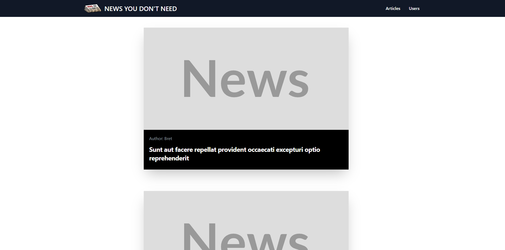
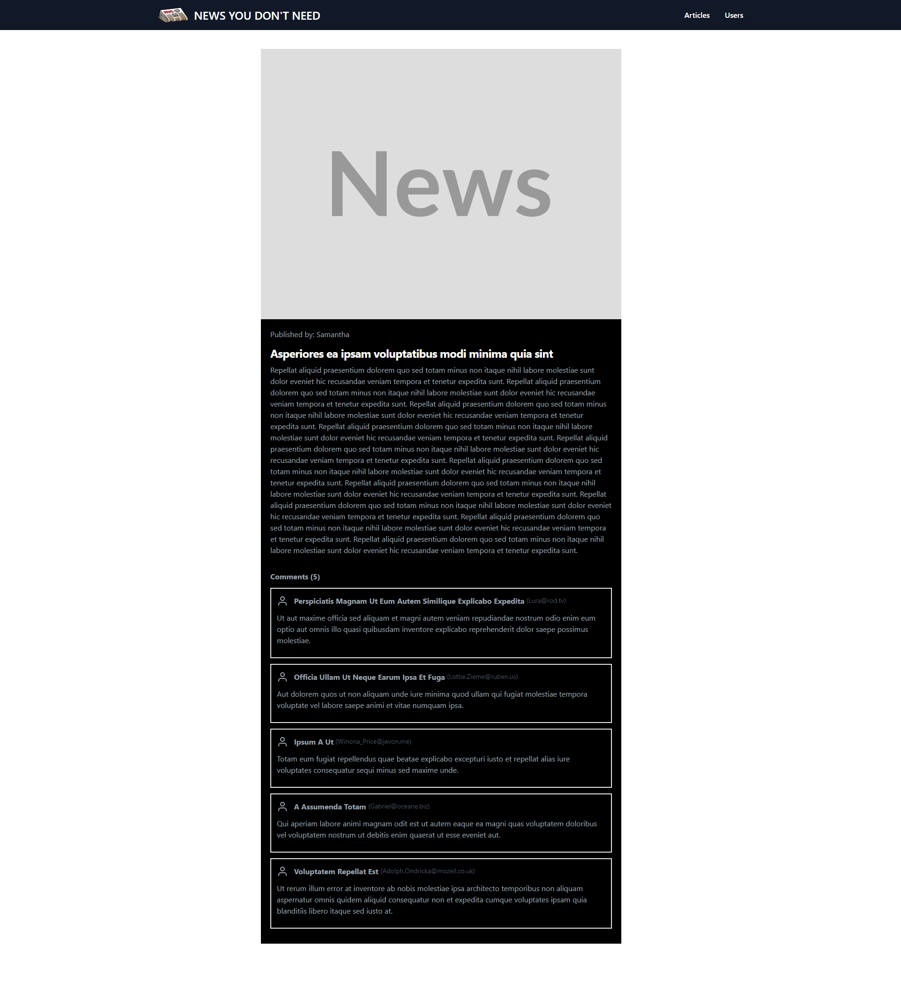
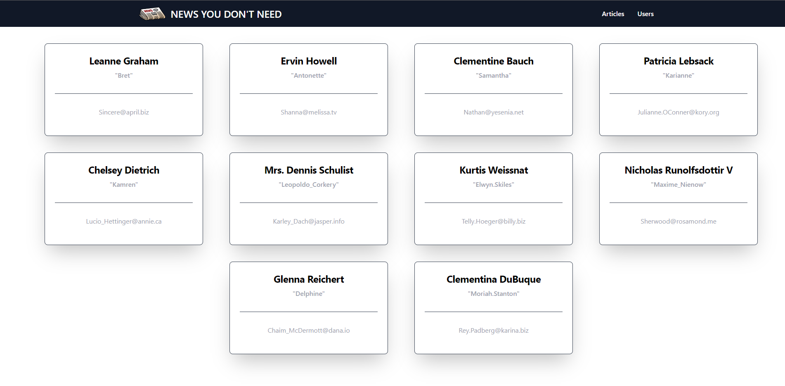
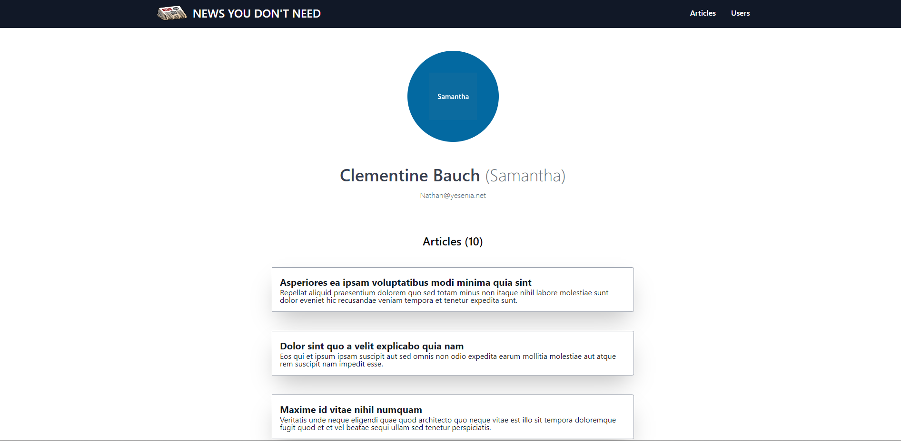

#  News You Don't Need [](https://www.php.net/)

Displays News You Don't Need.

### Preview:

Home: <br><br>


Single Article: <br><br>


Users: <br><br>


Single User: <br><br>


### Installation:

1. Clone or Download the project.
2. Run:
````
composer install
````
3. Navigate to `/public` directory:
````php
cd .\public\
````
4. Start a server from the terminal
```php
php -S localhost:8000
```


5. Navigate to http://localhost:8000 to see the site.

### Resources:

* [Jsonplaceholder](https://jsonplaceholder.typicode.com/)
* [Placehold](https://placehold.co/)
