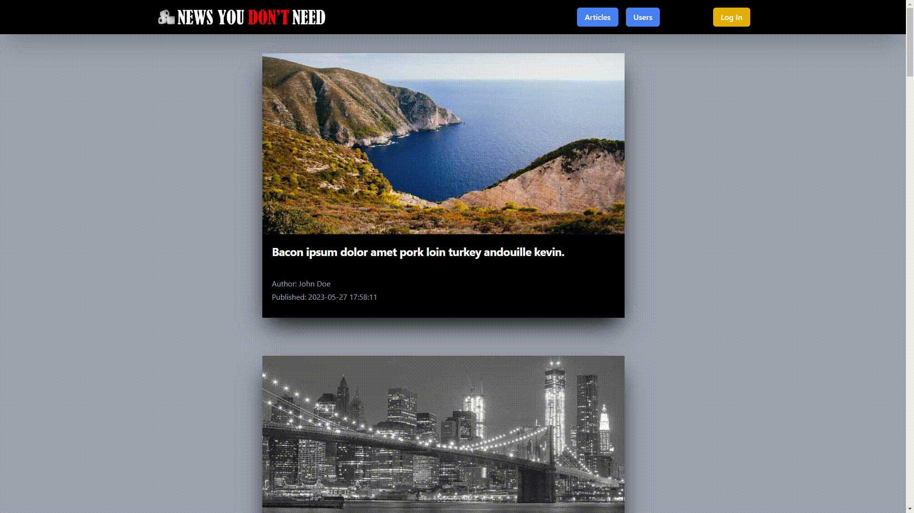
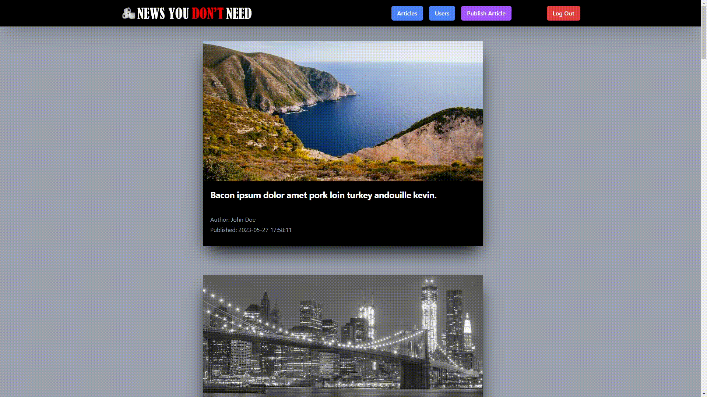

<p align="center"><a href="https://laravel.com" target="_blank"></a></p>

<p align="center">
<span>Displays News You Don't Need.</span><br>
</p>
<p align="center">
<a href="https://www.php.net/"></a>
</p>


### Preview:

Home with all the articles: <br><br>


Login page: <br><br>


Add new article: <br><br>


Edit or delete article: <br><br>


### Installation:

1. Clone or Download the project.
2. Run:
````
composer install
````
3. Navigate to `/public` directory:
````php
cd .\public\
````
4. Start a server from the terminal
```php
php -S localhost:8000
```


5. Navigate to http://localhost:8000 to see the site.

### Resources:

* [Jsonplaceholder](https://jsonplaceholder.typicode.com/)
* [Placehold](https://placehold.co/)
